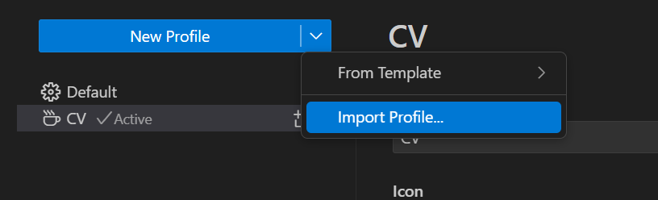
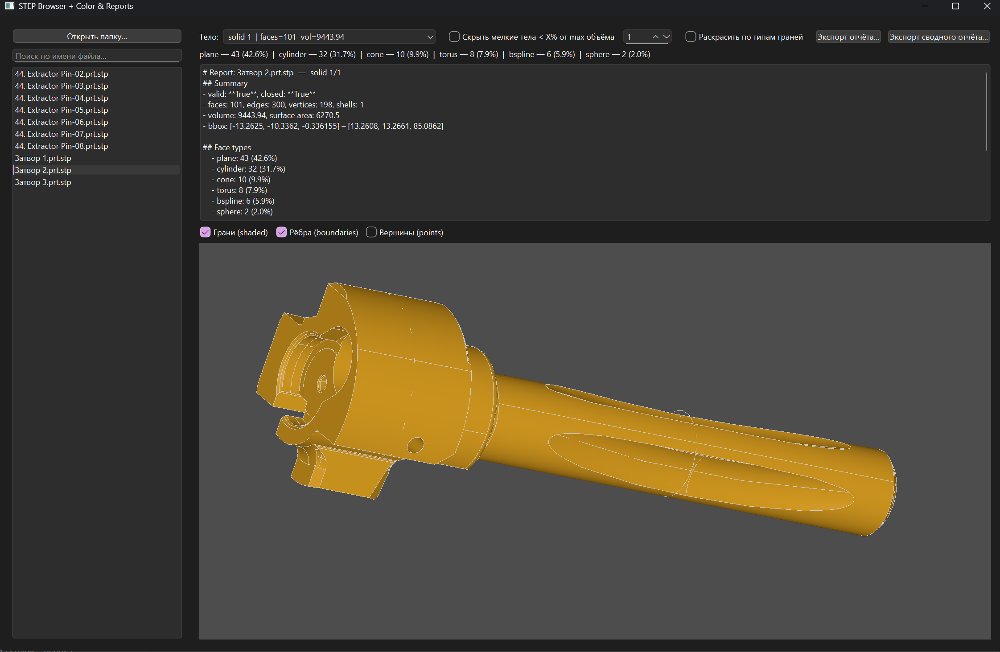

## Установка основных приложений и компонентов
- [vscode](https://code.visualstudio.com/download)
- [7-Zip](https://www.7-zip.org/download.html)
- [Miniconda](https://repo.anaconda.com/miniconda/) 
- Установите Cuda [официальная инструкция](https://docs.nvidia.com/cuda/cuda-installation-guide-microsoft-windows/index.html):
1) Скачайте инструменты и драйвера [Cuda Toolkit](https://developer.nvidia.com/cuda-downloads?target_os=Windows&target_arch=x86_64&target_version=11&target_type=exe_network) 
2) После устновки выполните комманду в PS или cmd `nvcc -V` в результате вывод должен быть примерно такой 
```bash
Copyright (c) 2005-2025 NVIDIA Corporation
Built on Wed_Jul_16_20:06:48_Pacific_Daylight_Time_2025
Cuda compilation tools, release 13.0, V13.0.48
Build cuda_13.0.r13.0/compiler.36260728_0
```

- Загрузите профиль в vscode. Файл `CV.code-profile` находится в архиве.

1) перейдите в профиль
> 
2) импортируйте профиль
> 

3) активируйте профиль в списке профилей

## Настройка среды разработки 
Запустите в среде conda следующую команду. Файл environment.yml в архиве!

```PS
conda env create --file environment.yml
```
активируйте окружение

```PS
conda activate brepnet
```
- Проверьте работу

Все скрипты находятся в файле `main.py`

После успешной установки запустите скрипт

```Python
import torch
x = torch.rand(5, 3)
print(x)
print(f'Cuda: {torch.cuda.is_available()}')
```

вывод примерно такой должен быть

```PS
tensor([[0.8175, 0.6376, 0.0282],
        [0.4350, 0.3071, 0.0940],
        [0.4407, 0.6174, 0.4704],
        [0.5683, 0.8086, 0.8490],
        [0.2749, 0.3888, 0.4871]])
Cuda: True
```

- проверьте работу с 3d

```Python
from OCC.Core.gp import gp_Pnt
p = gp_Pnt(1., 2., 3.)
print(p.X())
```
вывод

```PS
1.0
```

Также можете запустить визуализатор 3d моделей. Это позволит точно определить, что все функции доступны по чтению step моделей. В папке step есть примеры, выберите их в GUI step браузера. Если модели отображаются, то среда разработки готова!

```PS
python.exe step_browser.py
```




